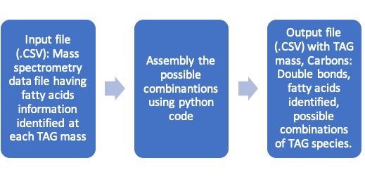

# Project title:Assembly of Triacylglycerol (TAG) molecular species using fatty acids
**Name**: Prasad Parchuri  
**Semester**: Spring 2019  
**Project area**: Lipids

## Objective: 
To write a Python program to assemble the possible TAG molecular species combinations using neutal loss of fatty acids identified at each TAG mass in the mass spectrometry data.

## Outcomes:
I want a function to produce a .CSV file with four columns having info about TAG mass, Carbons: Double bonds, fatty acids identified, possible combinations of TAG species.

## Rationale:

Triacylglycerols are the neutral lipids found in the oils. They have three fatty acids attached to glycerol backbone. The number of fatty acids in seed oils varies from 10 to 15, which results in number of triacylglycerols molecular species (~ 200-300) and is very complex. With growing research interest in undersatnding the triacylglycerol biosynthesis in oilseed crops, many scientist across the globe are using mass spectrometry tool to identify and quantifiy triacylglycerols. Howerver, processing the mass spectrometry data output is very complex and time consuming especially making the possible triacylglycerol molecular species from different fatty acids. Developing a python program to automate the TAG assembly will be an ideal strategy to reduce the complexity and errors in data processing. The main objective of this project is to write a python program to automate the TAG assembly.

## Sketch

## References:

Li, M., Butka, E., & Wang, X. (2014). Comprehensive quantification of triacylglycerols in soybean seeds by electrospray ionization mass spectrometry with multiple neutral loss scans. Scientific reports, 4, 6581.
